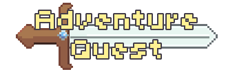
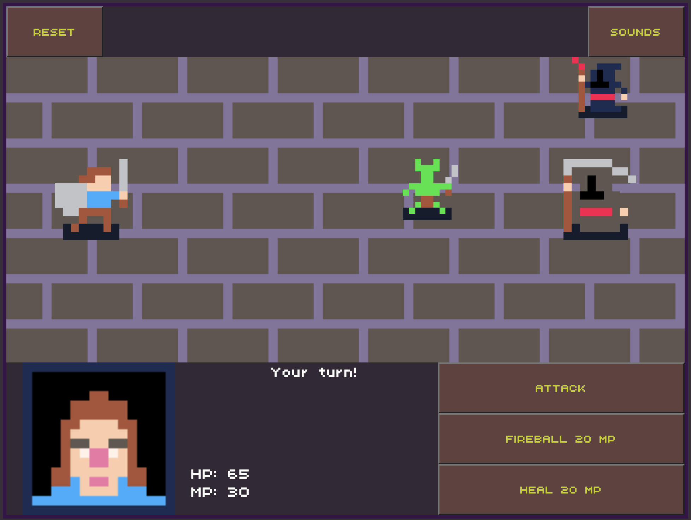

# [Play Adventure Quest!](https://MattARam.dev/)


<p>Adventure Quest is a turn-based RPG game where you, a brave adventurer, are tasked to defeat the evil Arch Wizard and save the world from destruction! This project follows the theme of a fantasy-style pixel art game with magic and other fantasy elements.</p>



## Getting Started

1. [Click here](https://MattARam.dev/) to play.
2. Once on the main screen, click the "Start Game" button to begin!

## Controls and Instructions

<p>This game only uses buttons to play and currently has no keyboard inputs logged/used for gameplay.</p>

- You can select an enemy to attack by using your mouse to select and click on your target.
- Attack, Magic, and Heal buttons can be pressed on your turn to choose which of the three actions you want to take. 
  - The Attack option is a no-cost low-damage attack; its reliability is consistent and helps to finish off low-health targets.
  - The Magic option is a high-damage attack that costs MP. It's a good way to burst down your foe.
  - Finally, the Heal option is a magic spell that recovers HP at the cost of MP; ensure you always have MP so that you can heal!
- HP can only be restored using a Heal spell, while MP slowly recovers every turn (10 MP per turn).

## Unique Features
Adventure Quest uses objects to create scenes, allowing additional scenes to be created by simply referencing the enemy list in `stageData.js`!
```
class Stage {
  constructor(stage) {
    this.stageLevel = stage.level
    this.enemies = stage.enemy
    this.background = stage.background
    this.playerMoves = [...document.getElementsByClassName("player-moves")]
  }
}
```
<br>Playable and non-playable characters use the same logic checks and functions for moves! This helps with modularity and allows different characters to be plugged in and work cohesively.

<br>Player data:
```
const player = [
  {name: "adventurer", attack: 10, magicAttack: 25, health: 65, mana: 30, heal: 25},
]
export default player
```
Enemy data:
```
const enemy = [
  {name: "orcBarb", attack: 5, magicAttack: 7, health: 30, mana: 20},
  {name: "orcMage", attack: 5, magicAttack: 15, health: 30, mana: 30},
  {name: "skeletonBarb", attack: 4, magicAttack: 8, health: 30, mana: 20},
  {name: "skeletonMage", attack: 4, magicAttack: 20, health: 30, mana: 40},
  {name: "zombie", attack: 3, magicAttack: 0, health: 20, mana: 0},
  {name: "wizard", attack: 3, magicAttack: 10, health: 20, mana: 30},
  {name: "archWizard", attack: 4, magicAttack: 15, health: 40, mana: 30},
]
export default enemy
```
Action functions:
```
function attackMove(actor, target) {
  console.log(`${actor.name} attacked ${target.name} for ${actor.attack} damage!`)
  console.log(`${target.name}'s HP went from ${target.health} to ${target.health-actor.attack}`)
  target.health -= actor.attack
}

function mAttackMove(actor, target) {
  if(actor.mana >= 20) {
    console.log(`${actor.name} attacked ${target.name} for ${actor.magicAttack} magic damage!`)
    console.log(`${target.name}'s HP went from ${target.health} to ${target.health-actor.magicAttack}`)
    target.health -= actor.magicAttack
    actor.mana -= 20
  }else {
    console.log(`${actor.name} doesnt have enough mana to cast fireball!`)
  }
}

function healMove(actor) {
  if(actor.mana >= 20) {
    console.log(`${actor.name} healed for ${actor.magicAttack} health! and now has ${actor.health + actor.magicAttack}`)
    actor.health += actor.magicAttack
    actor.mana -= 20
  }else {
    console.log(`${actor.name} doesnt have enough mana to cast fireball!`)
  }
}
```
## Technologies Used

- JavaScript
- HTML
- CSS
- Adobe Photoshop CS 2023
- Aseprite
- Audacity
- Git
- Netlify

## Upcoming Features

- Create idle and attack animations for entities.
- Add in more sound effects for the different options selected.
- Add in Music tracks for game screens.
- Create more levels for the player to go through.
- Create more playable characters/classes (Archer, Wizard).

## Known Bugs

- On initializing, both "begin-button" and "action-menu" are displayed, "begin-button" disappears as intended.
- Enemy selection does not work on selecting an enemy image; selecting the tile they occupy is a workaround for this bug.
- Reset functionality breaks on the win/loss screen.

## Attributions
- [Oryx Design Labs](https://www.oryxdesignlab.com/) for their "Wee Fantasy" and "8-Bit Sounds" asset libraries.
- [ROTMG Exalt OST](https://www.youtube.com/watch?v=uhG4TPImfOE) for their track "Passage".